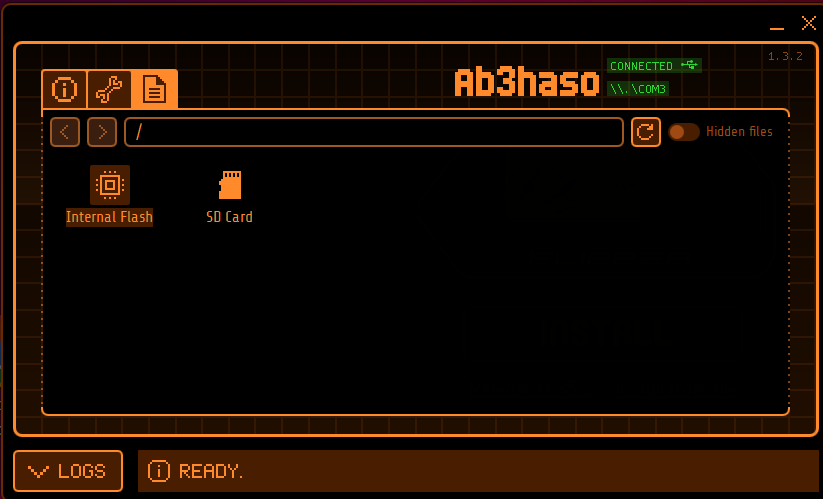
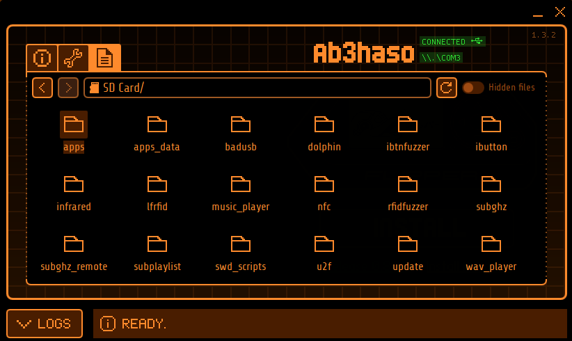
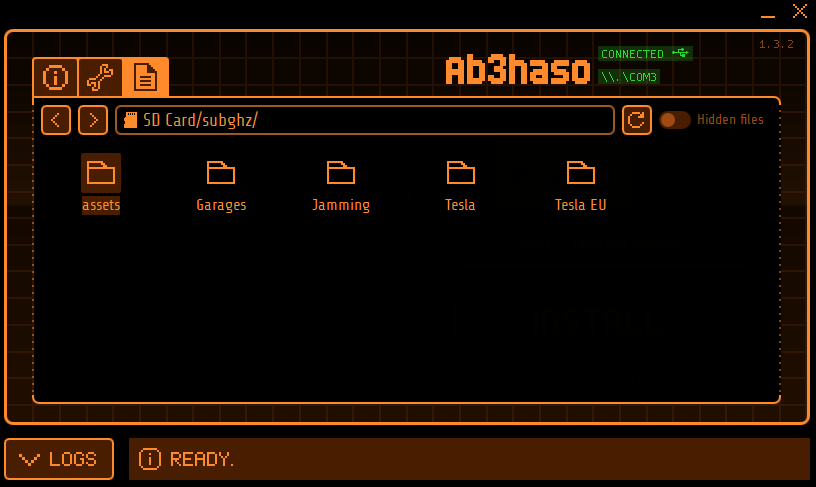

# FlipperSub-GHz
Sub-GHz for EU
## What can this package do?
- Jamming
- Open Tesla Charge Port

### Disclaimer
#### Most likely, it is not legal in your region. Because of this, you yourself are responsible for your actions )

## How to install

1. Install custom firmware on flipper zero <a href='https://github.com/DarkFlippers/unleashed-firmware/releases' >Install it</a>.
 
This firmware is required to remove restrictions
2. Download this package to your computer. I recommend that you download this package as a zip file.
3. Install Qflipper <a href='https://flipperzero.one/update'>official link</a>
4. connect the flipper to the computer
5. Go to FileManager
  

  
6. Next go to SD Card
  

  
7. Let's move on to sub-GHz
8. Drag the folders into the application
  
